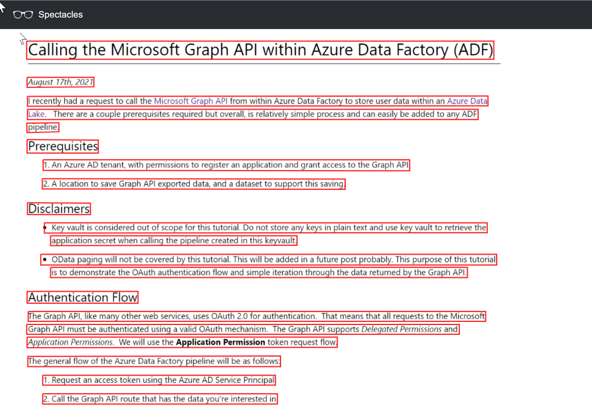

# Spectacles

Spectacles is a [Microsoft Blazor Server](https://dotnet.microsoft.com/apps/aspnet/web-apps/blazor) application with the purpose of 
visualizing the OCR capability of the [Computer Vision](https://docs.microsoft.com/en-us/azure/cognitive-services/computer-vision/overview) service 
on Microsoft Azure.



## Introduction
The Microsoft Azure Cognitive service includes many capabilities, including Computer Vision service. 
As part of this service, you can submit an image to be *read*.  The data returned includes pages, lines, words, and bounding box information.
You can use this information in a variety of applications.  However, when getting started, you need to write some code to 1) submit the image and 2) use the data from the model retrieved. 
This project was created so you can easily get started with Computer Vision on Azure.  With Spectacles, you can upload an image, and it will immediately draw the lines/words it found
using the Azure Computer Vision service. 

## Demo
Microsoft employees can access a demo here: [http://spectacles.azurewebsites.net](http://spectacles.azurewebsites.net).  If you aren't a Microsoft employee, move onto the Installation part of this document detailed below!

## Installation
The Spectacles solution consists of three resources. 
1. An App Service Plan (this can run on the free tier no problem)
2. The Web App Service 
3. A Storage Account (used for uploading blobs temporarily for the Computer Vision service)

The easiest way to install and use Spectacles is to deploy it within your Azure environment by using the supplied ARM template. 

After deployment you can set any additional settings or configurations within the web application that you'd like. 

> **Important** - It is recommended to use authentication for this service and prevent unauthorized access to the application.  Without any authentication, anyone can submit and use the Computer Vision service you've deployed, potentially causing increased Azure costs. 

## Configuration
There are 4 configuration options, detailed below. 

> Note: These settings should be set up as part of the ARM deployment process. 

Key | Value
--- | -----
ComputerVision:Endpoint | This you endpoint of the deployed Computer Vision service in Azure
ComputerVision:Key | This is your Computer Vision service key
ComputerVision:ModelVersion | This is the model version of the model that Spectacles will use when calling the Computer Vision service.  This can be left blank, and the model version will be set to ```latest```.  At the time of writing, the other available option is: ```2021-09-30-preview```.
ConnectionStrings:StorageAccount | This is the storage account connection string used by Spectacles to temporarily upload blobs to for the Computer Vision service to read from.  


## Usage

Once deployed, the application can be easily used.  

1. Navigate to the application.
2. Drag a photo onto the web browser window. 
3. Enjoy the Computer Vision output. 